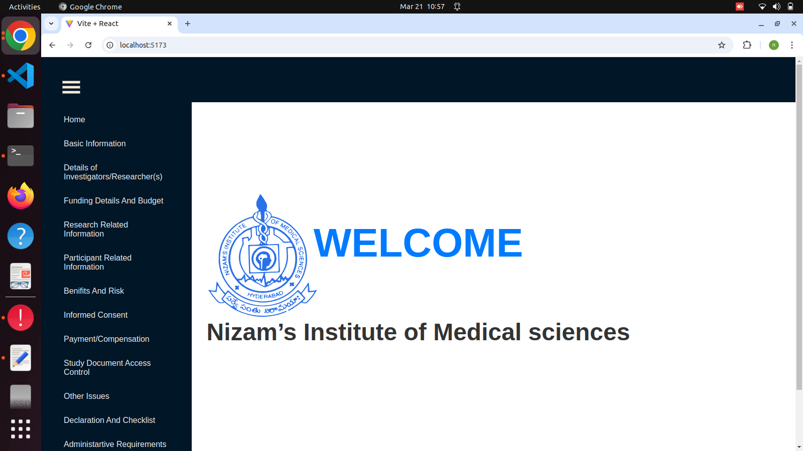
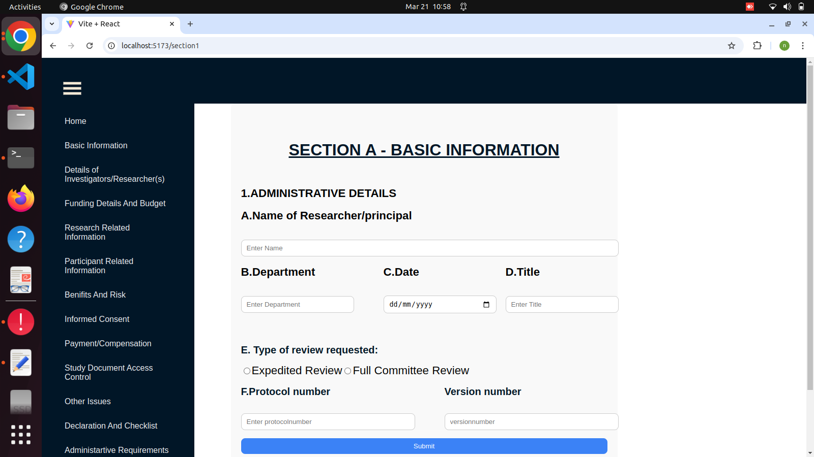
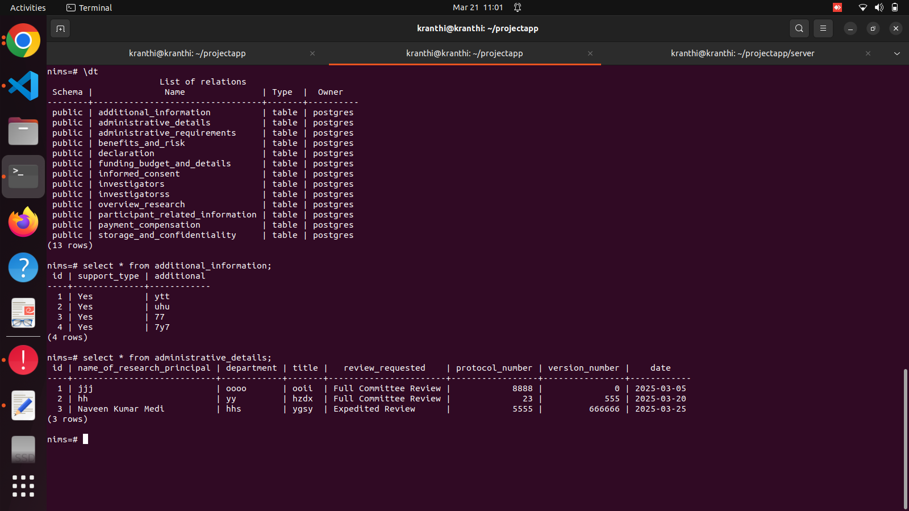

# NIMS APP

## Overview

Nimsapp is a web application built using React.js (initialized with Vite) for the frontend and Node.js with Express for the backend. It is designed to manage various operations efficiently, leveraging modern web development best practices.

## Features

- RESTful API integration with React.js frontend
- State management using React Hooks
- Secure API calls with Axios
- Database management using PostgreSQL

## Technologies Used

### Frontend:

- React.js (initialized with Vite)
- Bootstrap for responsive design
- Axios for API requests

### Backend:

- Node.js with Express
- PostgreSQL for database management

## Installation

### Prerequisites:

Ensure you have the following installed:

- Node.js & npm
- Git

### Setup Steps:

1. **Clone the repository:**
   ```bash
   git clone https://github.com/medinaveen9/Nimsapp.git
   cd Nimsapp
   ```
2. **Backend Setup:**
   ```bash
   cd server
   npm install
   npm start
   ```
3. **Frontend Setup:**
   ```bash
   cd src
   npm install
   npm run dev
   ```
4. **Access the Application:**
   - Frontend: http://localhost:5173
   - Backend API: http://localhost:3001

### Endpoints:

- Sample Screenshots:

  - Home page
    

  - First Section : Basic Information
    

  - Postgresql Screenshots:
    
